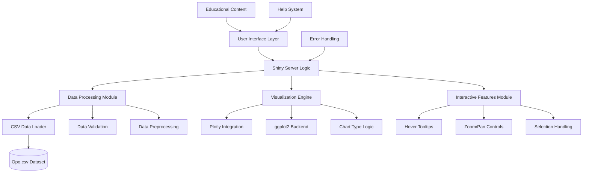

# Product Requirements Document (PRD)

## Interactive Weather Data Visualization Application

**Version:** 1.0  
**Date:** June 8, 2025  
**Author:** Product Requirements Team  
**Status:** Draft for Review

---

## Executive Summary

### Project Overview

This document outlines the requirements for developing an interactive Shiny data visualization application designed to help students and educators learn fundamental data visualization principles using real meteorological data. The application will provide an intuitive interface for exploring weather patterns through multiple chart types and interactive features.

### Purpose and Educational Value

The application serves as an educational tool to teach students:

- Basic data visualization principles and best practices
- When to use different chart types (scatter plots, line charts, bar charts)
- Interactive data exploration techniques
- Understanding relationships between meteorological variables

### Target Audience

**Primary Users:** Students learning data visualization and basic statistics
**Secondary Users:** Educators teaching data analysis, statistics, or meteorology courses
**User Level:** Beginner to intermediate data analysis experience

### Key Success Metrics

- Students can correctly identify appropriate chart types for different data relationships
- 95% of users can successfully create visualizations within 5 minutes of first use
- Application loads and responds within 3 seconds on typical student laptops
- Zero critical errors during normal operation

---

## Data Context and Analysis

### Dataset Overview

The application uses the `Opo.csv` dataset containing 366 daily weather observations with 22 meteorological variables.

### Variable Categories

#### Continuous Numerical Variables (18 variables)

Ideal for scatter plots and trend analysis:

**Temperature Measurements:**

- `MinTemp`: Daily minimum temperature (°C)
- `MaxTemp`: Daily maximum temperature (°C)
- `Temp9am`: Temperature at 9 AM (°C)
- `Temp3pm`: Temperature at 3 PM (°C)

**Precipitation and Evaporation:**

- `Rainfall`: Daily rainfall amount (mm)
- `Evaporation`: Daily evaporation (mm)
- `RISK_MM`: Risk of rainfall amount (mm)

**Wind Measurements:**

- `WindGustSpeed`: Maximum wind gust speed (km/h)
- `WindSpeed9am`: Wind speed at 9 AM (km/h)
- `WindSpeed3pm`: Wind speed at 3 PM (km/h)

**Atmospheric Conditions:**

- `Sunshine`: Daily sunshine hours
- `Humidity9am`: Relative humidity at 9 AM (%)
- `Humidity3pm`: Relative humidity at 3 PM (%)
- `Pressure9am`: Atmospheric pressure at 9 AM (hPa)
- `Pressure3pm`: Atmospheric pressure at 3 PM (hPa)
- `Cloud9am`: Cloud coverage at 9 AM (oktas)
- `Cloud3pm`: Cloud coverage at 3 PM (oktas)

#### Categorical Variables (4 variables)

Ideal for bar charts and frequency analysis:

**Wind Direction:**

- `WindGustDir`: Direction of maximum wind gust
- `WindDir9am`: Wind direction at 9 AM
- `WindDir3pm`: Wind direction at 3 PM

**Rain Indicators:**

- `RainToday`: Whether it rained today (Yes/No)
- `RainTomorrow`: Whether it will rain tomorrow (Yes/No)

### Data Quality Considerations

- Dataset contains 366 complete daily observations
- Some variables may have missing values (marked as NA)
- All temperature values are in Celsius
- Wind directions use standard compass notation (N, NE, E, SE, S, SW, W, NW)
- Pressure values in hectopascals (hPa)

---

## Functional Requirements

### Core Features

#### 1. Variable Selection Interface

**Requirement ID:** FR-001  
**Priority:** High  
**Description:** Users must be able to select variables for visualization axes

**Specifications:**

- Two dropdown menus for X-axis and Y-axis variable selection
- Variables grouped by type (Temperature, Wind, Pressure, etc.)
- Clear variable labels with units of measurement
- Default selections provided for new users
- Visual indicators for recommended variable combinations

**Acceptance Criteria:**

- All 22 variables available in both dropdowns
- Variable names display with descriptive labels and units
- Selection updates trigger automatic chart regeneration
- Invalid combinations provide helpful guidance messages

#### 2. Chart Type Selection

**Requirement ID:** FR-002  
**Priority:** High  
**Description:** Users must choose from four distinct visualization types

**Specifications:**

**A. Interactive Scatter Plot**

- Purpose: Show relationships between two continuous variables
- Features: Hover tooltips, zoom/pan capabilities, trend line option
- Recommendations: Automatically suggested for numerical variable pairs
- Educational notes: Explains correlation and outlier identification

**B. Interactive Line Plot**

- Purpose: Display trends over time or sequential data
- Features: Hover tooltips, zoom/pan, multiple line support
- Recommendations: Suggested when one axis represents sequential data
- Educational notes: Explains trend analysis and temporal patterns

**C. Interactive Bar Chart**

- Purpose: Compare categorical data or show distributions
- Features: Hover tooltips, sortable bars, color coding
- Recommendations: Suggested when one variable is categorical
- Educational notes: Explains frequency distributions and comparisons

**D. Data Table View**

- Purpose: Display raw data for detailed examination
- Features: Sorting, filtering, search functionality, pagination
- Always available regardless of variable selection
- Educational notes: Explains the importance of examining raw data

#### 3. Interactive Features

**Requirement ID:** FR-003  
**Priority:** Medium  
**Description:** Charts must provide interactive capabilities for data exploration

**Specifications:**

- **Hover Tooltips:** Display exact values, variable names, and units
- **Zoom and Pan:** Allow detailed examination of data regions
- **Selection Highlighting:** Click to highlight specific data points
- **Legend Interaction:** Toggle data series on/off
- **Download Options:** Export charts as PNG or PDF for assignments

#### 4. Educational Guidance System

**Requirement ID:** FR-004  
**Priority:** Medium  
**Description:** Provide contextual learning support throughout the application

**Specifications:**

- Chart type recommendations based on variable selection
- Pop-up explanations for when to use each visualization type
- Sample analysis questions for each chart combination
- Glossary of meteorological terms and statistical concepts
- Best practices tips for data interpretation

### User Interface Requirements

#### 5. Main Application Layout

**Requirement ID:** FR-005  
**Priority:** High  
**Description:** Application must provide intuitive and educational-friendly interface

**Layout Specifications:**

- **Header Section:** Application title, help button, about information
- **Control Panel:** Variable selection, chart type selection, options
- **Main Display Area:** Primary visualization area (75% of screen width)
- **Information Panel:** Educational content, variable descriptions, tips
- **Footer:** Data source information, application version

#### 6. Responsive Design

**Requirement ID:** FR-006  
**Priority:** Medium  
**Description:** Interface must work across different screen sizes and devices

**Specifications:**

- Minimum screen resolution: 1024x768 pixels
- Scales appropriately for laptop screens (1366x768 to 1920x1080)
- Chart area automatically resizes based on available space
- Control panels remain accessible at all screen sizes

---

## Technical Requirements

### Technology Stack

#### 7. Core Technologies

**Requirement ID:** TR-001  
**Priority:** High  
**Description:** Application must be built using R Shiny framework

**Required Technologies:**

- **R Version:** 4.0.0 or higher
- **Shiny Framework:** Latest stable version
- **RStudio:** Recommended IDE for development and deployment

#### 8. Required R Packages

**Requirement ID:** TR-002  
**Priority:** High  
**Description:** Dependencies needed for full application functionality

**Core Packages:**

```r
- shiny (>= 1.7.0)          # Web application framework
- shinydashboard (>= 0.7.0)  # Dashboard layout components
- DT (>= 0.20)              # Interactive data tables
- plotly (>= 4.10.0)        # Interactive visualizations
- dplyr (>= 1.0.0)          # Data manipulation
- ggplot2 (>= 3.3.0)        # Static plot generation
- readr (>= 2.0.0)          # CSV file reading
- shinyWidgets (>= 0.6.0)   # Enhanced UI widgets
```

**Optional Enhancement Packages:**

```r
- shinycssloaders          # Loading animations
- shinyjs                 # JavaScript integration
- colourpicker            # Color selection tools
- htmlwidgets             # Custom widget creation
```

#### 9. Performance Requirements

**Requirement ID:** TR-003  
**Priority:** High  
**Description:** Application must meet performance standards for educational use

**Performance Specifications:**

- **Load Time:** Initial application load < 3 seconds
- **Chart Generation:** New visualizations appear < 1 second after selection
- **Memory Usage:** < 200MB RAM for typical operation
- **Data Processing:** Handle 366-row dataset without performance degradation
- **Concurrent Users:** Support single-user local deployment

#### 10. Deployment Requirements

**Requirement ID:** TR-004  
**Priority:** High  
**Description:** Application must run locally on student computers

**Deployment Specifications:**

- **Local Deployment Only:** Runs through RStudio on individual computers
- **Operating System Support:** Windows 10+, macOS 10.14+, Ubuntu 18.04+
- **Installation Method:** R script or RStudio project file
- **Data Bundling:** `Opo.csv` file included with application
- **No Internet Required:** Fully functional offline after initial R package installation

### Data Handling Requirements

#### 11. Data Loading and Validation

**Requirement ID:** TR-005  
**Priority:** High  
**Description:** Robust data import and validation processes

**Specifications:**

- Automatic detection of `Opo.csv` file in application directory
- Validation of data structure (22 columns, proper data types)
- Graceful handling of missing values (NA)
- Error messages for corrupted or missing data files
- Data preprocessing for optimal visualization performance

#### 12. Data Security and Privacy

**Requirement ID:** TR-006  
**Priority:** Medium  
**Description:** Ensure data handling meets educational privacy standards

**Specifications:**

- All data processing occurs locally on user's computer
- No external data transmission or cloud storage
- No personal or sensitive information in dataset
- Data files remain in user's control at all times

---

## User Experience Design

### Interface Design Principles

#### 13. Educational User Experience

**Requirement ID:** UX-001  
**Priority:** High  
**Description:** Interface must support learning objectives and minimize confusion

**Design Principles:**

- **Simplicity:** Clean, uncluttered interface focusing on core functionality
- **Guidance:** Clear visual cues and helpful text throughout
- **Feedback:** Immediate response to user actions with appropriate messaging
- **Exploration:** Encourage experimentation with different variable combinations
- **Context:** Provide educational context for all visualization choices

#### 14. Accessibility Requirements

**Requirement ID:** UX-002  
**Priority:** Medium  
**Description:** Application must be accessible to users with diverse abilities

**Accessibility Features:**

- High contrast color schemes for better visibility
- Clear, readable fonts (minimum 12pt size)
- Alternative text for all visual elements
- Keyboard navigation support
- Screen reader compatibility for core functions

#### 15. Help and Documentation System

**Requirement ID:** UX-003  
**Priority:** Medium  
**Description:** Comprehensive support system for new users

**Help Features:**

- **Quick Start Guide:** Step-by-step tutorial for first-time users
- **Interactive Tooltips:** Contextual help for all interface elements
- **Video Tutorials:** Short screencasts demonstrating key features
- **FAQ Section:** Common questions and troubleshooting tips
- **Glossary:** Definitions of meteorological and statistical terms

---

## Quality Assurance Requirements

### Testing Requirements

#### 16. Functional Testing

**Requirement ID:** QA-001  
**Priority:** High  
**Description:** Comprehensive testing of all application features

**Testing Areas:**

- **Variable Selection:** All combinations of X/Y variable pairs
- **Chart Generation:** Each chart type with multiple variable combinations
- **Interactive Features:** Hover, zoom, pan, selection functionality
- **Data Table:** Sorting, filtering, and search operations
- **Error Handling:** Invalid inputs, missing data, corrupted files

#### 17. Compatibility Testing

**Requirement ID:** QA-002  
**Priority:** High  
**Description:** Ensure application works across target environments

**Testing Matrix:**

- **Operating Systems:** Windows 10/11, macOS 10.14+, Ubuntu 18.04+
- **R Versions:** 4.0.0, 4.1.0, 4.2.0, latest stable
- **RStudio Versions:** 1.4+, latest stable
- **Screen Resolutions:** 1024x768, 1366x768, 1920x1080
- **Browsers:** Default system browsers for Shiny viewer

#### 18. Educational Effectiveness Testing

**Requirement ID:** QA-003  
**Priority:** Medium  
**Description:** Validate application achieves learning objectives

**Testing Methods:**

- **User Testing:** Students complete visualization tasks
- **Learning Assessment:** Pre/post tests on visualization concepts
- **Usability Testing:** Task completion rates and error frequencies
- **Educator Feedback:** Teacher evaluation of educational value

### Error Handling and Recovery

#### 19. Error Management

**Requirement ID:** QA-004  
**Priority:** High  
**Description:** Graceful handling of errors and edge cases

**Error Scenarios:**

- **Missing Data File:** Clear instructions for file placement
- **Corrupted Data:** Validation messages with correction guidance
- **Package Dependencies:** Helpful installation instructions
- **Memory Issues:** Warnings and suggested solutions
- **Invalid Selections:** Automatic correction or clear guidance

---

## Documentation Requirements

### User Documentation

#### 20. Student User Guide

**Requirement ID:** DOC-001  
**Priority:** High  
**Description:** Comprehensive guide for student users

**Documentation Contents:**

- **Getting Started:** Installation and first use instructions
- **Interface Overview:** Explanation of all interface elements
- **Creating Visualizations:** Step-by-step tutorials for each chart type
- **Data Exploration:** Techniques for discovering patterns and relationships
- **Assignment Guidelines:** Sample exercises and analysis questions
- **Troubleshooting:** Common issues and solutions

#### 21. Educator Guide

**Requirement ID:** DOC-002  
**Priority:** High  
**Description:** Teaching resource for instructors

**Educator Contents:**

- **Learning Objectives:** Clear statement of educational goals
- **Lesson Plan Integration:** Suggested curriculum incorporation
- **Assessment Rubrics:** Evaluation criteria for student work
- **Discussion Questions:** Prompts for classroom analysis
- **Extension Activities:** Advanced exercises for interested students
- **Technical Support:** IT setup and troubleshooting for educators

### Technical Documentation

#### 22. Installation Guide

**Requirement ID:** DOC-003  
**Priority:** High  
**Description:** Clear technical setup instructions

**Installation Contents:**

- **System Requirements:** Hardware and software prerequisites
- **R Installation:** Step-by-step R and RStudio setup
- **Package Installation:** Required package installation scripts
- **Application Setup:** File placement and launching instructions
- **Verification:** Testing procedures to confirm proper installation

#### 23. Developer Documentation

**Requirement ID:** DOC-004  
**Priority:** Medium  
**Description:** Technical documentation for future development

**Developer Contents:**

- **Code Architecture:** Application structure and design patterns
- **Function Documentation:** Detailed API documentation
- **Extension Guidelines:** Instructions for adding new features
- **Testing Procedures:** Automated and manual testing protocols
- **Deployment Instructions:** Distribution and packaging guidelines

---

## Success Criteria and Acceptance Testing

### Educational Success Metrics

#### 24. Learning Outcome Measures

**Requirement ID:** SUCCESS-001  
**Priority:** High  
**Description:** Quantifiable measures of educational effectiveness

**Success Criteria:**

- **Chart Type Selection:** 80% of students correctly choose appropriate chart types for given data relationships
- **Data Interpretation:** 75% of students accurately describe patterns shown in generated visualizations
- **Engagement:** Students spend average of 15+ minutes exploring data relationships
- **Completion Rate:** 90% of students successfully complete basic visualization tasks

#### 25. Technical Performance Metrics

**Requirement ID:** SUCCESS-002  
**Priority:** High  
**Description:** Quantifiable technical performance standards

**Performance Criteria:**

- **Load Time:** Application starts within 3 seconds on standard laptop hardware
- **Responsiveness:** Chart updates occur within 1 second of variable selection
- **Stability:** Zero crashes during 30-minute continuous use sessions
- **Compatibility:** Successful installation and operation on 95% of target systems
- **Error Rate:** Less than 5% of user interactions result in error messages

### User Acceptance Criteria

#### 26. Student Acceptance Testing

**Requirement ID:** SUCCESS-003  
**Priority:** High  
**Description:** Student user satisfaction and usability requirements

**Acceptance Criteria:**

- **Ease of Use:** 85% of students rate interface as "easy" or "very easy" to use
- **Educational Value:** 80% of students report improved understanding of data visualization
- **Task Completion:** 90% of students complete assigned visualization tasks without assistance
- **Interface Clarity:** Less than 10% of interactions require help or clarification

#### 27. Educator Acceptance Testing

**Requirement ID:** SUCCESS-004  
**Priority:** High  
**Description:** Educator satisfaction and pedagogical effectiveness

**Acceptance Criteria:**

- **Teaching Integration:** Application fits into existing curriculum without major modifications
- **Student Engagement:** Teachers observe increased student interest in data analysis topics
- **Learning Support:** Application effectively demonstrates visualization concepts
- **Technical Reliability:** Minimal technical support required during classroom use

---

## Implementation Timeline and Milestones

### Development Phases

#### Phase 1: Core Development (Weeks 1-3)

**Milestone 1.1:** Basic Shiny application framework  
**Milestone 1.2:** Data loading and validation system  
**Milestone 1.3:** Variable selection interface  
**Milestone 1.4:** Basic scatter plot functionality

#### Phase 2: Visualization Features (Weeks 4-6)

**Milestone 2.1:** Line plot implementation  
**Milestone 2.2:** Bar chart functionality  
**Milestone 2.3:** Interactive data table  
**Milestone 2.4:** Chart interactivity (hover, zoom, pan)

#### Phase 3: Educational Features (Weeks 7-8)

**Milestone 3.1:** Educational guidance system  
**Milestone 3.2:** Help documentation integration  
**Milestone 3.3:** Chart type recommendations  
**Milestone 3.4:** User interface polish and refinement

#### Phase 4: Testing and Documentation (Weeks 9-10)

**Milestone 4.1:** Comprehensive functional testing  
**Milestone 4.2:** Cross-platform compatibility testing  
**Milestone 4.3:** User documentation completion  
**Milestone 4.4:** Final acceptance testing and deployment preparation

---

## Risk Assessment and Mitigation

### Technical Risks

#### High Priority Risks

**Risk:** Package dependency conflicts in different R environments  
**Mitigation:** Provide specific package version requirements and installation scripts  
**Contingency:** Create Docker container for consistent environment

**Risk:** Performance issues with large datasets on older student computers  
**Mitigation:** Optimize data processing and implement progressive loading  
**Contingency:** Provide data subset options for slower systems

#### Medium Priority Risks

**Risk:** Inconsistent chart rendering across different operating systems  
**Mitigation:** Extensive cross-platform testing during development  
**Contingency:** Platform-specific optimization and fallback options

**Risk:** Student difficulty with R/RStudio installation  
**Mitigation:** Detailed installation guides and video tutorials  
**Contingency:** Pre-configured RStudio Cloud workspace option

### Educational Risks

#### Medium Priority Risks

**Risk:** Application complexity overwhelming beginning students  
**Mitigation:** Progressive disclosure of features and guided tutorials  
**Contingency:** Simplified "beginner mode" with limited options

**Risk:** Insufficient pedagogical value for learning objectives  
**Mitigation:** Educator involvement in testing and feedback collection  
**Contingency:** Additional educational content and guided exercises

---

## Appendices

### Appendix A: Variable Descriptions and Units

| Variable      | Description                    | Unit    | Type        | Chart Recommendations       |
| ------------- | ------------------------------ | ------- | ----------- | --------------------------- |
| MinTemp       | Daily minimum temperature      | °C      | Continuous  | Scatter, Line               |
| MaxTemp       | Daily maximum temperature      | °C      | Continuous  | Scatter, Line               |
| Rainfall      | Daily rainfall amount          | mm      | Continuous  | Scatter, Line, Bar (binned) |
| Evaporation   | Daily evaporation              | mm      | Continuous  | Scatter, Line               |
| Sunshine      | Daily sunshine hours           | hours   | Continuous  | Scatter, Line               |
| WindGustDir   | Direction of maximum wind gust | Compass | Categorical | Bar                         |
| WindGustSpeed | Maximum wind gust speed        | km/h    | Continuous  | Scatter, Line               |
| WindDir9am    | Wind direction at 9 AM         | Compass | Categorical | Bar                         |
| WindDir3pm    | Wind direction at 3 PM         | Compass | Categorical | Bar                         |
| WindSpeed9am  | Wind speed at 9 AM             | km/h    | Continuous  | Scatter, Line               |
| WindSpeed3pm  | Wind speed at 3 PM             | km/h    | Continuous  | Scatter, Line               |
| Humidity9am   | Relative humidity at 9 AM      | %       | Continuous  | Scatter, Line               |
| Humidity3pm   | Relative humidity at 3 PM      | %       | Continuous  | Scatter, Line               |
| Pressure9am   | Atmospheric pressure at 9 AM   | hPa     | Continuous  | Scatter, Line               |
| Pressure3pm   | Atmospheric pressure at 3 PM   | hPa     | Continuous  | Scatter, Line               |
| Cloud9am      | Cloud coverage at 9 AM         | oktas   | Discrete    | Scatter, Line, Bar          |
| Cloud3pm      | Cloud coverage at 3 PM         | oktas   | Discrete    | Scatter, Line, Bar          |
| Temp9am       | Temperature at 9 AM            | °C      | Continuous  | Scatter, Line               |
| Temp3pm       | Temperature at 3 PM            | °C      | Continuous  | Scatter, Line               |
| RainToday     | Whether it rained today        | Yes/No  | Categorical | Bar                         |
| RISK_MM       | Risk of rainfall amount        | mm      | Continuous  | Scatter, Line               |
| RainTomorrow  | Whether it will rain tomorrow  | Yes/No  | Categorical | Bar                         |

### Appendix B: Sample Educational Exercises

#### Exercise 1: Temperature Relationships

**Objective:** Understand correlation between different temperature measurements
**Instructions:**

1. Create a scatter plot with MinTemp (X-axis) and MaxTemp (Y-axis)
2. Observe the relationship pattern
3. Discussion: Why might this relationship exist?

#### Exercise 2: Seasonal Patterns

**Objective:** Identify temporal trends in weather data
**Instructions:**

1. Create a line plot showing MaxTemp over the 366-day period
2. Identify seasonal patterns
3. Discussion: What causes these patterns?

#### Exercise 3: Categorical Analysis

**Objective:** Understand frequency distributions
**Instructions:**

1. Create a bar chart showing WindGustDir frequencies
2. Identify most and least common wind directions
3. Discussion: What geographic factors might influence this?

### Appendix C: Technical Architecture Diagram



---

**Document Version Control:**

- Version 1.0: Initial PRD creation
- Review Date: [To be scheduled]
- Approval Date: [Pending review]
- Next Review: [3 months after approval]

**Stakeholder Approval:**

- [ ] Product Owner
- [ ] Educational Consultant
- [ ] Technical Lead
- [ ] User Experience Designer
